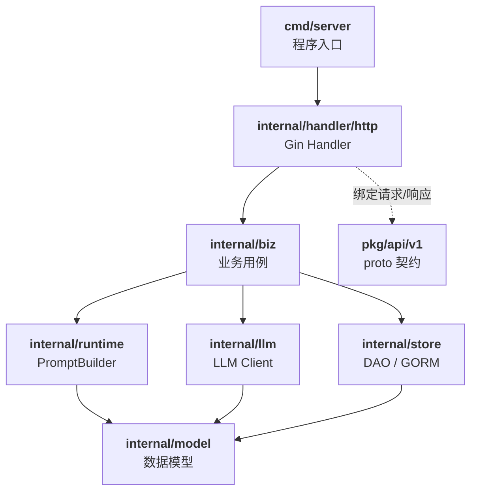
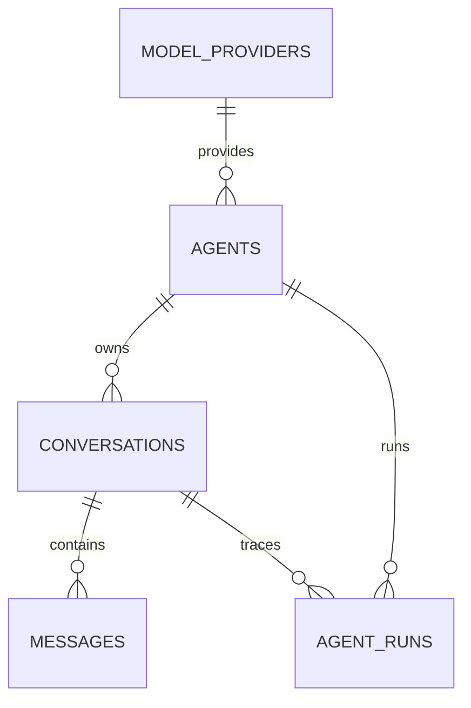

# agentops-platform

一个轻量级 **AgentOps / LLMOps** 平台后端，用于学习和实践 Agent 管理、模型接入、会话运行、Trace，以及后续 RAG / Tool Calling / 云原生部署能力。

> 📖 完整文档见 [`docs/`](./docs)：[架构设计](./docs/architecture.md) · [API 参考](./docs/api.md) · [Roadmap](./docs/roadmap.md)

## 项目目标

第一版聚焦"最小闭环"：**接入模型 → 定义智能体 → 会话对话 → 落库 Trace**。后续按 [Roadmap](./docs/roadmap.md) 引入 RAG、Tool Calling 与云原生编排能力。

## 当前能力（V1）

- **ModelProvider 管理**：OpenAI 兼容协议 CRUD，可挂接任意兼容网关
- **Agent 管理**：CRUD + `system_prompt` / `temperature` / `max_tokens` / `model` 覆盖
- **Conversation / Message**：会话消息落库，`conversation_id` 为空时自动新建会话
- **OpenAI-compatible Chat**：一次调用完成"落库用户消息 → 调 LLM → 落库回复 → 回填 Trace"
- **AgentRun 运行记录**：`pending / running / success / failed` 状态机，失败也留痕
- **Token / Latency 统计**：入库到 `AgentRun` 表，构成 V1 的 Trace 载体
- **数据一致性**：删除会话时事务级联清理 `messages` 与 `agent_runs`

## 架构图

分层架构（详见 [`docs/architecture.md`](./docs/architecture.md)）：



领域模型（ER 简图）：



## 快速开始

### 环境要求

- Go 1.24+
- PostgreSQL 13+

### 1. 初始化数据库

```bash
# 创建数据库
createdb agentops

# 执行建表脚本
psql -d agentops -f migrations/001_init.sql
```

### 2. 修改配置

编辑 [`config/config.yaml`](./config/config.yaml)，填入你的 PostgreSQL 连接信息：

```yaml
enable-memory-store: false
postgresql:
  addr: "127.0.0.1:5432"
  username: "postgres"
  password: "your-password"
  database: "agentops"
```

### 3. 构建并运行

```bash
# 构建二进制（产物在 _output/ 下）
make build

# 或直接运行
go run ./cmd/server --config config/config.yaml
```

服务启动后监听在 `HTTPOptions.Addr`（默认示例 `127.0.0.1:38443`），可用 `curl http://127.0.0.1:38443/healthz` 验证。

### 4. 常用 Make 目标

| 目标 | 说明 |
|---|---|
| `make build`    | 编译源码 |
| `make test`     | 执行单元测试 |
| `make cover`    | 单测 + 覆盖率校验 |
| `make lint`     | 静态代码检查 |
| `make format`   | 格式化 Go 与 proto 源码 |
| `make protoc`   | 编译 protobuf 文件 |
| `make tidy`     | 自动增删依赖 |

## API 示例

完整接口清单见 [`docs/api.md`](./docs/api.md)；REST Client 联调脚本见 [`test/http/`](./test/http)。

以下用 curl 演示"注册 Provider → 建 Agent → 发起 Chat"最小闭环。

### 1. 注册一个模型提供商

```bash
curl -X POST http://127.0.0.1:38443/v1/model-providers \
  -H "Content-Type: application/json" \
  -d '{
    "name": "openai-compatible",
    "provider_type": "openai",
    "base_url": "https://api.openai.com/v1",
    "api_key": "sk-xxx",
    "default_model": "gpt-4o-mini"
  }'
# => { "id": 1 }
```

### 2. 创建一个智能体

```bash
curl -X POST http://127.0.0.1:38443/v1/agents \
  -H "Content-Type: application/json" \
  -d '{
    "name": "assistant",
    "system_prompt": "你是一个乐于助人的助手",
    "model_provider_id": 1,
    "temperature": 0.7,
    "max_tokens": 2048
  }'
# => { "id": 1 }
```

### 3. 发起对话

```bash
# 首次对话不传 conversation_id，平台会自动新建会话
curl -X POST http://127.0.0.1:38443/v1/agents/1/chat \
  -H "Content-Type: application/json" \
  -d '{ "message": "你好，请自我介绍一下" }'
# => {
#      "conversation_id": 1,
#      "message_id": 2,
#      "run_id": 1,
#      "answer": "你好！我是……",
#      "usage": { "prompt_tokens": 20, "completion_tokens": 40, "total_tokens": 60 },
#      "latency_ms": 812
#    }
```

### 4. 查看 Trace

```bash
# 会话消息列表
curl http://127.0.0.1:38443/v1/conversations/1/messages

# 运行记录（含 token、耗时、状态）
curl http://127.0.0.1:38443/v1/agent-runs/1
```

## Roadmap

分三个版本迭代，详见 [`docs/roadmap.md`](./docs/roadmap.md)：

| 版本 | 主题 | 主要能力 |
|---|---|---|
| **V1**（当前） | 最小闭环 | ModelProvider / Agent / Conversation / Message / Chat / AgentRun Trace |
| **V2**         | 引入 RAG | KnowledgeBase / Document / VectorStore / Retriever |
| **V3**         | Tool Calling | Tool 资源 / ToolExecutor / 多轮工具调用 Trace |
| 后期           | 平台化 | AgentService / 小 Operator / 多租户 / 可观测性 |

## 目录结构

```
agentops-platform/
├── cmd/                    程序入口 + model 反向生成
├── config/                 运行配置
├── docs/                   架构 / API / Roadmap 文档
├── internal/               业务实现（biz / handler / llm / model / runtime / store …）
├── migrations/             建表脚本
├── pkg/api/v1/             proto 契约 + 生成的 pb.go
├── scripts/make-rules/     Makefile 子规则
└── test/http/              REST Client 联调脚本
```
