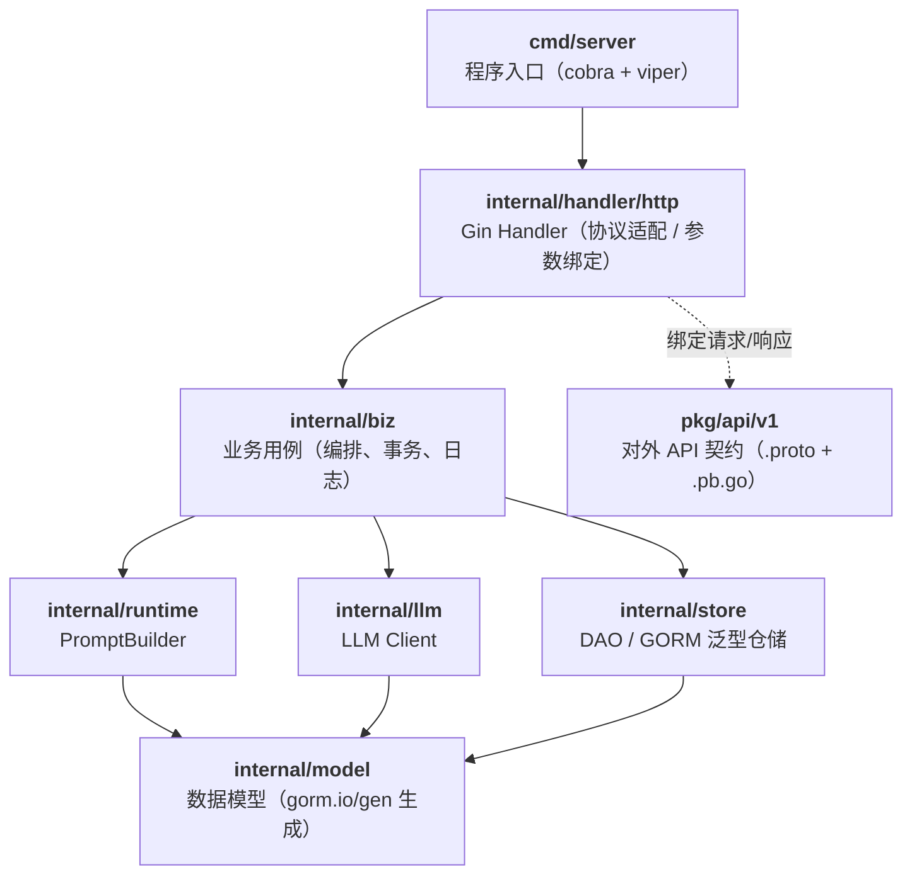
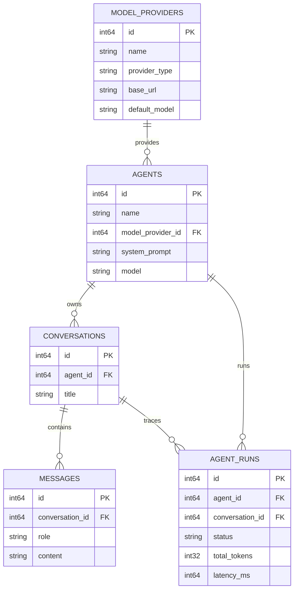
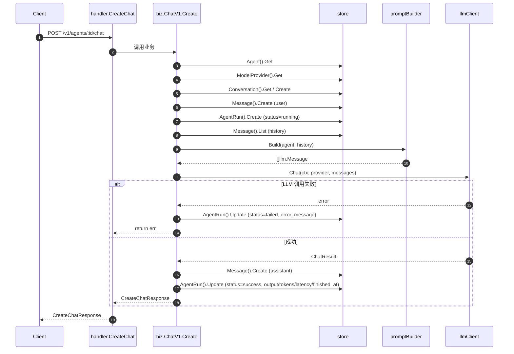

# 架构设计（Architecture）

本文档描述 `agentops-platform` 后端的整体架构、分层职责、关键模块与运行时数据流。所有描述均以当前仓库源码为准（见 `internal/` 与 `pkg/api/v1/`）。

---

## 1. 目标与定位

`agentops-platform` 是一个轻量级 **AgentOps / LLMOps** 平台后端，用于统一管理：

- 模型提供商（`ModelProvider`）：OpenAI 兼容协议的接入配置。
- 智能体（`Agent`）：绑定模型 + system prompt + 采样参数。
- 会话与消息（`Conversation` / `Message`）：多轮对话上下文。
- 运行记录（`AgentRun`）：每次 LLM 调用的输入输出、token、耗时、状态。

第一版聚焦"最小闭环"：**接入模型 → 定义智能体 → 会话对话 → 落库 Trace**。

---

## 2. 分层架构

采用经典的 **DDD/Clean Architecture 风格分层**，依赖方向自上而下：



各层职责：

| 层 | 目录 | 职责 |
|---|---|---|
| Cmd | `cmd/server` | 启动流程：加载配置 → wire 装配 → 启动 HTTP Server |
| Handler | `internal/handler/http` | Gin 路由回调，绑定请求参数 → 调用 biz → 用 `core.WriteResponse` 返回 |
| Biz | `internal/biz` | 一次业务用例的编排（例如 chat 主流程），跨多个 store/runtime/llm |
| Runtime | `internal/runtime` | 与"跑一次 Agent"直接相关的领域逻辑，如 `PromptBuilder` |
| LLM | `internal/llm` | 与外部大模型交互的统一抽象（`Client` 接口 + OpenAI-Compatible 实现） |
| Store | `internal/store` | 数据访问层，基于 `onexlib` 的 `genericstore` 泛型仓储 + 事务 `TX` |
| Model | `internal/model` | GORM 表模型，主要由 `cmd/gen-gorm-model` 自动生成 |
| API | `pkg/api/v1` | proto 契约与生成的 `pb.go`，供 handler 绑定请求/响应 |

关键约定：
- **依赖只允许向下**：handler → biz → runtime/llm/store → model。
- **接口在上层定义、实现在下层**：如 `biz.IBiz`、`llm.Client`、`runtime.PromptBuilder`、`store.IStore` 都是接口，方便 mock（已通过 `go:generate mockgen` 生成 `mock_*.go`）。
- **依赖注入统一由 [wire](https://github.com/google/wire) 装配**：见 [`internal/wire.go`](../internal/wire.go) 与 `wire_gen.go`。

---

## 3. 核心模块

### 3.1 Handler 层

- 入口：[`internal/httpserver.go`](../internal/httpserver.go)，使用 Gin。
- 每个业务对应一个 handler 文件（`agent.go` / `conversation.go` / `agent_run.go` / `model_provider.go`）。
- Handler 只做：**参数绑定 → 调用 biz → 写响应**，不含业务逻辑。

路由结构（详见 [api.md](./api.md)）：

```
/healthz
/v1/model-providers      CRUD
/v1/agents               CRUD
/v1/agents/:id/chat      对话入口
/v1/conversations        列表 / 消息 / 删除
/v1/agent-runs           列表 / 详情
```

### 3.2 Biz 层

- 入口：[`internal/biz/biz.go`](../internal/biz/biz.go)，`IBiz` 聚合了 5 个子业务。
- 每个子业务位于 `internal/biz/v1/<name>/`，命名后缀 `Biz` / `Expansion`。
- 子业务通过 `New(store, ...)` 构造，依赖注入透明。

最复杂的是 [`chat`](../internal/biz/v1/chat/chat.go)，其 `Create` 主流程如下：

```
1. loadChatContext           加载 agent / modelProvider / conversation
                              （conversation_id 为空时自动新建会话）
2. store.Message().Create    落库用户消息
3. store.AgentRun().Create   创建运行记录（Status=running）
4. buildLLMMessages          查询历史消息 + PromptBuilder.Build
5. llmClient.Chat            调用大模型
   ├─ 失败：markAgentRunFailed（更新状态为 failed）
   └─ 成功：↓
6. store.Message().Create    落库 assistant 回复
7. markAgentRunSuccess       回填 output / model / tokens / latency / finished_at
8. return CreateChatResponse
```

关键设计：
- **AgentRun 是"过程性 Trace"**：`running → success/failed` 状态机，输入 / 输出 / token / 耗时都在这里沉淀，是第一版 Trace 能力的载体。
- **失败也要留痕**：即使 LLM 调用报错，也会更新 `AgentRun.Status = failed`。
- **删除会话时同时清理下游**：`conversation` 的 `Delete` 用事务级联删除 `messages` 与 `agent_runs`，避免孤儿数据。

### 3.3 Runtime 层

目前只有 [`PromptBuilder`](../internal/runtime/prompt_builder.go)：将 `Agent.SystemPrompt` + 历史 `Messages` 转为发送给 LLM 的 `[]llm.Message`。

> 该层是未来"Agent 运行编排"的扩展点，例如加入 RAG 检索、工具调用等。

### 3.4 LLM 层

- 抽象接口：[`llm.Client.Chat(ctx, provider, messages) (*ChatResult, error)`](../internal/llm/client.go)
- 默认实现：[`openai_compatible.go`](../internal/llm/openai_compatible.go)，直接走 `POST {base_url}/chat/completions`。
- `NewClient()` 目前统一返回 OpenAI 兼容实现，未来可按 `provider.ProviderType` 分支扩展。
- 类型定义：[`types.go`](../internal/llm/types.go)（`Message` / `Usage` / `ChatResult`）—— 仅用于 LLM 交互，不落库。

### 3.5 Store 层

- 入口：[`internal/store/store.go`](../internal/store/store.go)，`IStore` 暴露 5 个子 store + `TX` 事务方法。
- 每个子 store 都基于 `onexlib` 的 `genericstore.Store[T]` 泛型仓储，提供 `Create/Update/Delete/Get/List`。
- 表结构见 [`migrations/001_init.sql`](../migrations/001_init.sql)。

### 3.6 Model 层

- 全部 GORM 模型都通过 [`cmd/gen-gorm-model`](../cmd/gen-gorm-model/gen_gorm_model.go) 从 PostgreSQL 反向生成为 `*.gen.go`。
- 手写的领域枚举（不由 gen 覆盖）：
  - [`message_role.go`](../internal/model/message_role.go)：`system / user / assistant / tool`
  - [`agent_run_status.go`](../internal/model/agent_run_status.go)：`pending / running / success / failed`

---

## 4. 领域模型（ER 简图）



关系说明：

- `agents.model_provider_id`  → `model_providers.id`
- `conversations.agent_id`    → `agents.id`
- `messages.conversation_id`  → `conversations.id`
- `agent_runs.agent_id`       → `agents.id`
- `agent_runs.conversation_id`→ `conversations.id`

> 当前 schema 未声明数据库外键（`FOREIGN KEY`），应用层通过事务保证一致性。

---

## 5. 一次 Chat 调用的数据流



响应结构：`conversation_id` / `message_id` / `run_id` / `answer` / `usage` / `latency_ms`。

---

## 6. 关键约定与规范

- **错误处理**：biz 层所有 `return err` 处必须打 `log.Errorw`，带业务字段（`agent_id` / `conversation_id` / …）与 `err`。
- **枚举值**：所有状态类字段（如 `Role` / `Status`）必须使用 `internal/model` 下的常量，禁止硬编码字符串。
- **事务边界**：跨多张表的写操作使用 `b.store.TX(ctx, func(ctx) error { ... })`。
- **手写文件与生成文件区分**：`*.gen.go` 由 gen 工具覆盖，禁止手工修改；手写枚举/辅助放同包非 `.gen.go` 文件。
- **接口 + Mock**：所有对外接口都通过 `go:generate mockgen` 生成对应 `mock_*.go`，方便 biz/handler 层做单元测试。

---

## 7. 目录结构速览

```
agentops-platform/
├── cmd/
│   ├── gen-gorm-model/          反向生成 model
│   └── server/                  服务入口
├── config/
│   └── config.yaml              运行配置
├── docs/                        文档（本目录）
├── internal/
│   ├── biz/                     业务用例
│   ├── handler/http/            Gin 路由回调
│   ├── llm/                     LLM Client 抽象与实现
│   ├── model/                   GORM 数据模型
│   ├── pkg/                     内部通用组件（log / errno / server / conversion / known）
│   ├── runtime/                 Agent 运行时（PromptBuilder …）
│   ├── store/                   数据访问层
│   ├── httpserver.go            Gin 服务器 & 路由注册
│   ├── server.go                服务器初始化
│   └── wire.go / wire_gen.go    依赖注入装配
├── migrations/
│   └── 001_init.sql             建表脚本
├── pkg/api/v1/                  proto 契约 + 生成的 pb.go
├── scripts/make-rules/          Makefile 子规则
└── test/http/                   REST Client 手工联调脚本
```

---

## 8. 演进方向

见 [roadmap.md](./roadmap.md)：第二版引入 KnowledgeBase / VectorStore（RAG），第三版引入 Tool Calling / 云原生编排。
